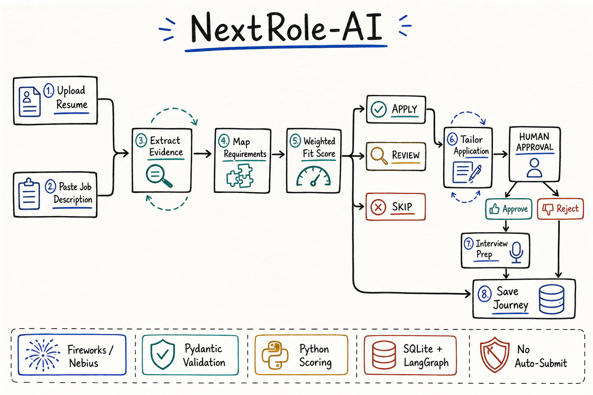

# NextRole-AI

NextRole-AI is a stateful AI job-application and interview copilot. It maps job requirements to resume evidence, calculates a defensible fit score, prepares truthful application material, pauses for human approval, and creates gap-driven interview preparation.



## Project intention

The project demonstrates production-minded AI engineering in one understandable vertical workflow: structured outputs, shared state, deterministic scoring, conditional routing, durable checkpoints, human approval, safeguards, failure recovery, and evaluation. It deliberately uses one LangGraph with specialized nodes instead of many autonomous agents.

## Current workflow

`parse_resume -> analyze_job -> calculate_fit -> APPLY/REVIEW/SKIP -> tailor_application -> human approval -> interview_prep -> save`

- SKIP roles are saved immediately.
- Rejected packages are saved without interview preparation.
- Approved packages become `READY_TO_SUBMIT`.
- NextRole-AI never submits forms, sends messages, or contacts recruiters.

## Models and modes

| Provider or mode | Configuration | Purpose |
|---|---|---|
| Fireworks AI | `accounts/fireworks/models/deepseek-v4-flash-0731` | Default structured extraction and generation model. Reasoning is disabled so the output budget is reserved for schema-complete JSON. |
| Nebius | `Qwen/Qwen3-235B-A22B` | Optional OpenAI-compatible hosted alternative. |
| Local fallback | No key required | Keeps resume parsing, job parsing, fit analysis, and interview preparation from terminating when a provider fails or truncates. |
| Demo mode | No key required | Exercises the workflow with lexical matching; it is not a semantic assessment. |

All hosted responses are constrained with JSON Schema and validated with Pydantic. Invalid, empty, or truncated output is retried once with a larger budget. Provider errors are normalized and recorded in graph state.

## Logical agents and graph nodes

These are logical responsibilities implemented as nodes in one graph:

| Logical agent | LangGraph node | Responsibility |
|---|---|---|
| Resume Analysis Agent | `parse_resume` | Extract candidate facts, skills, experience, domains, and education. |
| Job Analysis Agent | `analyze_job` | Extract complete required/preferred skills and responsibilities. |
| Job Fit Agent | `calculate_fit` | Map requirements to evidence; deterministic Python owns the final score. |
| Application Agent | `tailor_application` | Produce truthful, editable resume suggestions and recruiter content. |
| Human Approval Gate | `human_approval` | Interrupt execution until the user approves or rejects. |
| Interview Agent | `interview_prep` | Generate gap-connected questions and study actions, with a free local fallback. |
| Persistence Nodes | `save_*` | Save skipped, rejected, and ready-to-submit journeys. |

## Deterministic tools

- PDF extraction with PyPDF
- Pydantic schema validation
- Skill normalization and deduplication
- Complete requirement-to-evidence reconciliation
- Weighted scoring and APPLY/REVIEW/SKIP routing
- Local evidence-based fallbacks
- SQLite application tracker
- Durable LangGraph SQLite checkpointer
- Editable Streamlit approval interface

## Scoring

The model extracts evidence and proposes bounded component assessments. Python calculates the final score:

| Component | Weight |
|---|---:|
| Skills | 40% |
| Experience | 30% |
| Domain | 15% |
| Education | 5% |
| Preferences | 10% |

- APPLY: score >= 75
- REVIEW: score 55-74
- SKIP: score < 55

## Setup

1. Install Python 3.11+ and [uv](https://docs.astral.sh/uv/).
2. Add your Fireworks key to the ignored `.env` file:

   ```dotenv
   LLM_PROVIDER=fireworks
   FIREWORKS_API_KEY=your_key_here
   FIREWORKS_MODEL=accounts/fireworks/models/deepseek-v4-flash-0731
   ```

3. Install and run:

   ```powershell
   uv sync
   uv run streamlit run app.py
   ```

Set `LLM_PROVIDER=nebius` and fill `NEBIUS_API_KEY` to use Nebius. After changing model configuration, fully restart Streamlit and start a new journey.

## Persistence, privacy, and safety

SQLite at `data/nextrole.db` stores application summaries and LangGraph checkpoints. The Applications tab can reopen saved threads. Raw resume text is excluded from the tracker record but remains in the checkpoint so interrupted work can resume.

- Tailoring must not invent employers, technologies, metrics, duties, or certifications.
- Missing evidence remains a visible gap.
- Every application action remains manual.
- Local fallbacks are labeled and recorded in state.
- Model errors are caught instead of exposing Streamlit tracebacks.

## Documentation

- [Complete project documentation](docs/NextRole-AI_Project_Documentation-v2.docx)
- [Process infographic](docs/assets/nextrole-ai-process-handdrawn.png)

## Development

```powershell
uv run pytest -q
uv run ruff check .
uv run ruff format --check .
```

The current MVP intentionally omits job scraping, browser automation, external submission, Pinecone, Mem0, LlamaIndex, and multi-agent orchestration. Planned next versions add candidate preferences, OCR, multi-job comparison, evaluation datasets, authorized integrations, optional long-term memory, and production-grade multi-user persistence.
